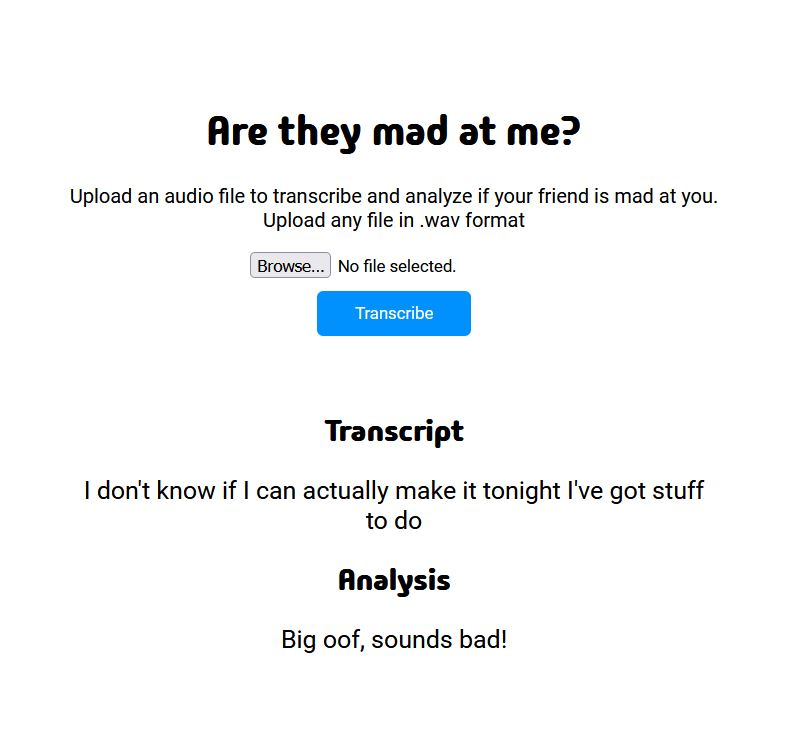

# Simple Speech Recognition Project

## Overview

This project is a speech recognition system designed to transcribe speech from `.wav` files. Currently, it features a Flask application to run the transcription service locally.

Right now it's using sentiment analysis on text that is transcribed, but further I'd like to use text and raw audio. Using Twitter-roberta-base-sentiment which is a roBERTa model trained on ~58M tweets and fine-tuned for sentiment analysis.

Next step will be finetuning the model, then analyzing audio pitch and tone and combine that with Roberta.



## Quick Start

1. **Clone the Repo**

    ```
    git clone https://github.com/nnoble13/anxious_audio.git
    ```

2. **Install Dependencies**

    ```
    pip install -r requirements.txt
    ```

3. **Run the Flask App**

    Start the transcription service with:

    ```
    flask run app.py
    ```

    Navigate to `http://127.0.0.1:5000/` to upload `.wav` files for transcription. or whatever local host


## Future Work

Sentiment analysis will be integrated to assess the emotions in the transcribed text, leveraging NLP techniques.

## Contributing

Feel free to fork, modify, and submit pull requests. For substantial changes, please open an issue first.
